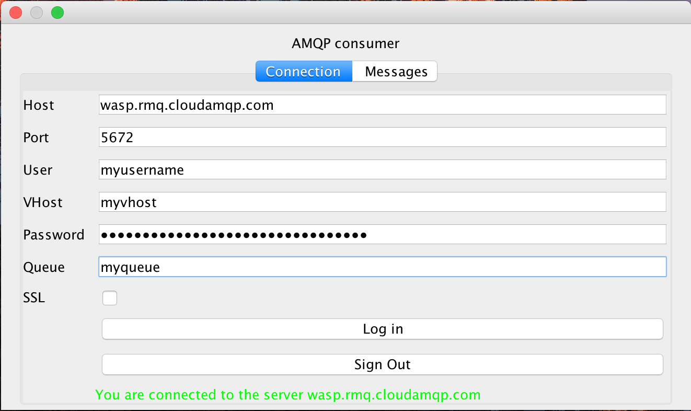
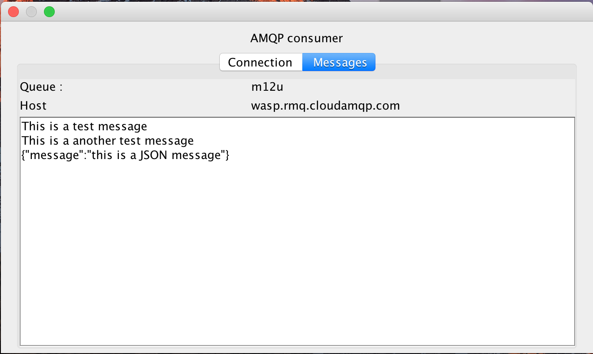

JAVA AMQP GUI consumer
===
An example in executable JAR format is available with the current version [here](out/artifacts/AMQP_jar/AMQP.jar) (or in the ````out/artifacts/AMQP_jar```` folder)


#### Connection



#### Read messages



#### Override me

##### Create your listener

Consumer message event

```java
import com.m12u.amqp.consumer.Consumer;
import com.m12u.amqp.consumer.AMQPMessage;
import com.m12u.amqp.listener.AMQPMessageListener;

Consumer consumer = new Consumer(user, password, host, vhost, port, ssl, queue);
consumer.addAMQPMessageListener(new AMQPMessageListener() {
    @Override
    public void onMessageReceived(AMQPMessage message) {
        // your logic here...
        String msg = message.getMessage();
    }
});
```

Consumer exception event
```java
import com.m12u.amqp.consumer.Consumer;
import com.m12u.amqp.listener.AMQPConsumerErrorListener;

Consumer consumer = new Consumer(user, password, host, vhost, port, ssl, queue);
consumer.addAMQPErrorListener(new AMQPConsumerErrorListener() {
    @Override
    public void onErrorReceved(Exception exception) {
        // your logic here...
        String msg = exception.getMessage();
    }
});
```
